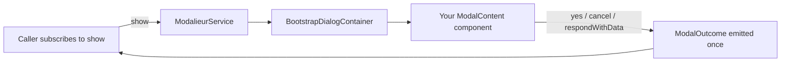

# @kazepis/ngx-modalieur

**Reactive Bootstrap modals for Angular — a thin layer on [CDK Dialog](https://material.angular.dev/cdk/dialog/overview).**

[](https://www.npmjs.com/package/@kazepis/ngx-modalieur)


```bash
npm install @kazepis/ngx-modalieur @angular/cdk bootstrap
```

## Table of contents

- [What is this?](#what-is-this)
- [Why use it?](#why-use-it)
- [When to use something else](#when-to-use-something-else)
- [Requirements](#requirements)
- [Setup](#setup)
- [Quick start](#quick-start)
- [Core concepts](#core-concepts)
- [Usage guide](#usage-guide)
  - [Message boxes](#message-boxes)
  - [Custom modal components](#custom-modal-components)
  - [Passing data in and out](#passing-data-in-and-out)
  - [Configuration](#configuration)
  - [Reactive patterns](#reactive-patterns)
  - [Auto-close with observables](#auto-close-with-observables)
  - [Programmatic control](#programmatic-control)
  - [Custom layouts](#custom-layouts)
- [API reference](#api-reference)
- [Appendix: Migration from ngx-bootstrap / KorrModalService](#appendix-migration-from-ngx-bootstrap--korrmodalservice)
- [Testing](#testing)
- [License](#license)

## What is this?

ngx-modalieur wraps **Angular CDK `Dialog`** with a **Bootstrap 5.3** shell, a standardized **`ModalOutcome`** result model, and convenience APIs for confirm/alert dialogs.

It is **not** a replacement for CDK Dialog. Focus trapping, overlay positioning, backdrop, and Escape handling still come from CDK. This library adds the Bootstrap markup, bridging CSS, reactive close semantics, and message-box shortcuts so you do not rebuild that glue in every app.

## Why use it?

| | Raw CDK Dialog | ngx-modalieur |
| --- | --- | --- |
| Styling | Bring your own container and CSS | Bootstrap `.modal-dialog` shell + bridging styles |
| Close result | `dialogRef.close(value)` — shape is yours | Standardized `{ result: ModalResult; data? }` |
| Message boxes | Build yourself | `confirm()`, `alert()`, `messageBox()` |
| App-wide defaults | DIY injection token | `provideModalieur({ … })` |
| Auto-close on streams | Wire `takeUntil` + `close()` yourself | `showUntil()` / `showUntilCondition()` |

**Subscribe, don't wire.** `show()` returns `Observable<ModalOutcome>`. Open a modal, react in one `subscribe` or `pipe` — no modal IDs, no global result bus, no `setResult(id, …)` from inside the component.

**Bootstrap without glue.** `ModalieurService` automatically applies `BootstrapDialogContainer`, which wraps your component in `.modal > .modal-dialog > .modal-content`. You only render header, body, and footer.

**Built-in confirm / alert.** One-liners for the dialogs every app reimplements.

**Observable-driven auto-close.** Keep a modal open until a timer fires, a hub event arrives, or an async job completes — with a dedicated `ModalResult.AutoClose`.

## When to use something else

- **Angular Material apps** — use [`MatDialog`](https://material.angular.dev/components/dialog/overview); it is integrated with Material theming.
- **Non-Bootstrap design systems** — use CDK Dialog directly with your own container.
- **A single one-off overlay** — CDK alone is enough; this library shines when modals are a recurring pattern.
- **Angular &lt; 22** — not supported. Peer dependencies require `@angular/core`, `@angular/common`, and `@angular/cdk` `^22.0.0`.

## Requirements

| Package | Version | Required |
| --- | --- | --- |
| `@angular/core`, `@angular/common` | `^22.0.0` | Yes |
| `@angular/cdk` | `^22.0.0` | Yes |
| `bootstrap` | `^5.3.0` | Optional (needed for the default Bootstrap look) |

## Setup

**1. Install**

```bash
npm install @kazepis/ngx-modalieur @angular/cdk bootstrap
```

**2. Add global styles** (e.g. in `angular.json` → `projects.[app].architect.build.options.styles`):

```json
"node_modules/bootstrap/dist/css/bootstrap.min.css",
"node_modules/@angular/cdk/overlay-prebuilt.css",
"node_modules/@kazepis/ngx-modalieur/styles/ngx-modalieur.css"
```

The library stylesheet bridges CDK overlay behavior with Bootstrap modal appearance (backdrop darkness, scrollable body layout, enter animation).

**3. Register app-wide defaults** (optional but recommended):

```ts
// app.config.ts
import { ApplicationConfig } from '@angular/core';
import { provideModalieur } from '@kazepis/ngx-modalieur';

export const appConfig: ApplicationConfig = {
  providers: [
    // Override only what you need; unset fields keep MODALIEUR_DEFAULTS.
    provideModalieur({ dismissible: false, size: 'lg' })
  ]
};
```

Calling `provideModalieur()` with no arguments registers built-in defaults. Omitting `provideModalieur()` entirely also works — the service falls back to `MODALIEUR_DEFAULTS` internally.

## Quick start

**1. Define a modal component** — extend `ModalContent`, render Bootstrap inner sections, close via helpers:

```ts
import { Component, inject } from '@angular/core';
import { MODAL_DATA, ModalContent } from '@kazepis/ngx-modalieur';

@Component({
  standalone: true,
  template: `
    <div class="modal-header">
      <h5 class="modal-title">{{ data.title }}</h5>
      <button type="button" class="btn-close" aria-label="Close" (click)="cancel()"></button>
    </div>
    <div class="modal-body">{{ data.message }}</div>
    <div class="modal-footer">
      <button type="button" class="btn btn-secondary" (click)="no()">No</button>
      <button type="button" class="btn btn-primary" (click)="yes()">Yes</button>
    </div>
  `
})
export class ConfirmModalComponent extends ModalContent {
  protected readonly data = inject<{ title: string; message: string }>(MODAL_DATA);
}
```

**2. Open it and react to the outcome:**

```ts
import { inject } from '@angular/core';
import { ModalieurService, ModalResult } from '@kazepis/ngx-modalieur';

// In a component or service:
private readonly modalieur = inject(ModalieurService);

openConfirm(): void {
  this.modalieur
    .show(ConfirmModalComponent, {
      data: { title: 'Confirm', message: 'Are you sure?' }
    })
    .subscribe(outcome => {
      if (outcome.result === ModalResult.Yes) {
        // user clicked Yes
      }
    });
}
```

Or skip the custom component entirely:

```ts
this.modalieur.confirm('Delete item?', 'This cannot be undone.').subscribe(result => {
  if (result === ModalResult.Yes) {
    this.deleteItem();
  }
});
```

## Core concepts

### Two layers



1. **Your component** (`extends ModalContent`) — renders `.modal-header`, `.modal-body`, `.modal-footer` and closes via `yes()`, `cancel()`, `respondWithData()`, etc.
2. **Dialog shell** (`BootstrapDialogContainer`) — applied automatically unless `unstyled: true`. Wraps your component in Bootstrap's outer modal markup.

You do **not** extend `BootstrapDialogContainer` for normal modals. It is exported for advanced CDK container customization only.

For fully custom layouts (viewport-filling overlays with your own CSS), pass `unstyled: true` and style the component yourself.

### Result flow

Every close produces a **`ModalOutcome<T>`**:

```ts
interface ModalOutcome<TData = unknown> {
  result: ModalResult;
  data?: TData;
}
```

The observable emits **once**, then completes. Backdrop click and Escape map to `ModalResult.Cancel` when `dismissible` is `true`.

`confirm()`, `alert()`, and `messageBox()` unwrap this to `Observable<ModalResult>` for convenience.

### Config layering

Per-call config is merged in this order (later wins):

```
MODALIEUR_DEFAULTS  →  provideModalieur(...)  →  per-call config
```

Built-in defaults (`MODALIEUR_DEFAULTS`):

| Option | Default |
| --- | --- |
| `backdrop` | `true` |
| `centered` | `true` |
| `dismissible` | `true` |
| `scrollable` | `false` |
| `unstyled` | `false` |

## Usage guide

### Message boxes

All message-box APIs open the same built-in component (`MessageBoxDialog`). Pick the API by what you need back and how much wiring you want the library to do:

| API | Prefer when | `subscribe` receives | A11y (`aria-labelledby` / `aria-describedby`) |
| --- | --- | --- | --- |
| `confirm()` / `alert()` | Yes/No or OK only | `ModalResult` | Auto-wired |
| `messageBox({ … })` | Custom button set | `ModalResult` | Auto-wired |
| `show(MessageBoxDialog, …)` | You want `ModalOutcome`, or full control over `ModalConfig` / aria | `ModalOutcome` | **You** must set aria (see below) |

#### Shorthand (recommended for most cases)

`confirm()`, `alert()`, and `messageBox()` are thin wrappers around `show(MessageBoxDialog, …)`. They unwrap the result to `ModalResult` and point the dialog at the title and body element ids for screen readers.

```ts
this.modalieur.confirm('Delete item?', 'This cannot be undone.').subscribe(result => {
  if (result === ModalResult.Yes) {
    this.deleteItem();
  }
});

this.modalieur.alert('Saved', 'Your changes were saved.', { size: 'sm' }).subscribe();

this.modalieur
  .messageBox({
    title: 'Retry?',
    message: 'Could not reach the server.',
    buttons: MessageBoxButtons.RetryCancel
  })
  .subscribe(result => {
    // ModalResult.Retry | ModalResult.Cancel
  });
```

`confirm()` and `alert()` do not force a size — pass `{ size: 'sm' }` (or any `ModalConfig` field) when you want a compact dialog.

Available button sets (`MessageBoxButtons` enum): `OK`, `OKCancel`, `YesNo`, `YesNoCancel`, `AbortRetryIgnore`, `RetryCancel`.

#### Low-level: `show(MessageBoxDialog, …)`

Use this when you need the full `ModalOutcome` shape (`{ result, data? }`) for consistency with other `show()` calls, or when you want to pass `ModalConfig` without going through `messageBox()`.

These two calls open the **same dialog**; only the return type and a11y wiring differ:

```ts
// Shorthand — emits ModalResult.Yes | ModalResult.No; aria wired for you.
this.modalieur.confirm('Delete?', 'Cannot be undone.').subscribe(result => { /* … */ });

// Equivalent low-level — emits ModalOutcome; you handle aria yourself.
this.modalieur
  .show(MessageBoxDialog, {
    data: { title: 'Delete?', message: 'Cannot be undone.', buttons: MessageBoxButtons.YesNo }
  })
  .subscribe(outcome => {
    // outcome.result === ModalResult.Yes | ModalResult.No | ModalResult.Cancel
  });
```

**Accessibility:** `messageBox()` / `confirm()` / `alert()` automatically set `ariaLabelledBy` and `ariaDescribedBy` to match the ids on the message-box title and body (`mdlr-message-box-title`, `mdlr-message-box-body`). If you call `show(MessageBoxDialog, …)` directly, pass those ids (or import the constants) so CDK Dialog can label the overlay correctly:

```ts
import { MESSAGE_BOX_BODY_ID, MESSAGE_BOX_TITLE_ID, MessageBoxDialog, MessageBoxButtons } from '@kazepis/ngx-modalieur';

this.modalieur.show(MessageBoxDialog, {
  ariaLabelledBy: MESSAGE_BOX_TITLE_ID,
  ariaDescribedBy: MESSAGE_BOX_BODY_ID,
  data: { title: 'Delete?', message: 'Cannot be undone.', buttons: MessageBoxButtons.YesNo }
}).subscribe(outcome => { /* … */ });
```

#### Custom markup (content projection)

```ts
@Component({
  imports: [MessageBoxDialog],
  template: `
    <mdlr-message-box>
      <div mbHeader>Custom header</div>
      <div mbBody>Custom body</div>
      <div mbFooter class="d-flex gap-2">
        <button type="button" class="btn btn-secondary" (click)="cancel()">Dismiss</button>
        <button type="button" class="btn btn-primary" (click)="ok()">Got it</button>
      </div>
    </mdlr-message-box>
  `
})
export class MyMessageBox extends ModalContent {}
```

### Custom modal components

Extend `ModalContent` and use the protected close helpers:

| Method | `ModalResult` |
| --- | --- |
| `yes(data?)` | `Yes` |
| `no(data?)` | `No` |
| `ok(data?)` | `Ok` |
| `cancel(data?)` | `Cancel` |
| `abort(data?)` | `Abort` |
| `retry(data?)` | `Retry` |
| `ignore(data?)` | `Ignore` |
| `respondWithData(data)` | `Data` |
| `close(result?, data?)` | any |

The modal component does not inject a global modal service. Closing the dialog **is** emitting the result.

### Passing data in and out

- **Input** — pass via `config.data`; inject with `MODAL_DATA` inside the modal.
- **Output** — declare on `ModalContent<TOut>`; returned as `outcome.data` when the matching helper is used.

```ts
class EditModal extends ModalContent<{ saved: boolean }> {
  protected readonly data = inject<{ id: number }>(MODAL_DATA);

  protected save = () => this.respondWithData({ saved: true });
}

this.modalieur.show(EditModal, { data: { id: 7 } }).subscribe(outcome => {
  console.log(outcome.data?.saved); // true after save()
});
```

### Configuration

All options live on `ModalConfig` and can be set app-wide (`provideModalieur`) or per call:

| Option | Description | Default |
| --- | --- | --- |
| `data` | Injected into the modal via `MODAL_DATA` | — |
| `size` | `'sm' \| 'md' \| 'lg' \| 'xl' \| 'fullscreen'` | Bootstrap medium (`md` adds no extra class) |
| `centered` | `.modal-dialog-centered` | `true` |
| `scrollable` | `.modal-dialog-scrollable` | `false` |
| `dismissible` | Backdrop click / Escape closes → `Cancel` | `true` |
| `backdrop` | Render CDK backdrop | `true` |
| `unstyled` | Skip Bootstrap shell; component owns layout | `false` |
| `ariaLabel` | CDK `ariaLabel` | — |
| `ariaLabelledBy` | CDK `ariaLabelledBy` | — |
| `ariaDescribedBy` | CDK `ariaDescribedBy` | — |

Non-dismissible modals with no backdrop (common in kiosk / operator UIs):

```ts
provideModalieur({ dismissible: false, backdrop: false, centered: true })
```

Scrollable body with long content:

```ts
this.modalieur.show(ConfirmModalComponent, {
  scrollable: true,
  data: { title: 'Terms', message: longText }
});
```

### Reactive patterns

Opening a modal returns an `Observable` — compose with the rest of your RxJS pipelines:

```ts
import { filter, switchMap } from 'rxjs/operators';

this.modalieur
  .confirm('Delete item?', 'This cannot be undone.')
  .pipe(
    filter(result => result === ModalResult.Yes),
    switchMap(() => this.api.deleteItem(id))
  )
  .subscribe();
```

**Compared to imperative modal stacks** many codebases inherit:

```ts
// Before: ref + global bus + setResult inside the component
const ref = modalService.showAndReturnRef(MyModal);
modalService.getModalResult(ref).subscribe(/* ... */);
// inside modal: modalService.setResult(ref.id, ResultType.Yes);

// After: one subscribe, close helpers inside the component
this.modalieur.show(MyModal, { data }).subscribe(outcome => {
  if (outcome.result === ModalResult.Yes) this.save();
});
```

| API | Emits | When |
| --- | --- | --- |
| `show(…)` | `ModalOutcome<T>` | User closes or dismisses |
| `confirm()` / `alert()` / `messageBox()` | `ModalResult` | Button click or dismiss |
| `showUntil(…)` / `showUntilCondition(…)` | `ModalOutcome` with `AutoClose` | User action **or** observable fires |
| `showAndReturnRef(…).closed$` | `ModalOutcome<T>` | Same as `show`, plus you hold `ModalRef` |

### Auto-close with observables

Keep a modal open until an external signal fires, then close with `ModalResult.AutoClose`.

| | `showUntil` | `showUntilCondition` |
| --- | --- | --- |
| Closes when | First emission (any value) | First **truthy** emission |
| `false`, `0`, `''` | **Closes** | Ignored — modal stays open |
| Typical use | Timers, one-shot events | Readiness signals (`loaded$`, `saveComplete$`) |

```ts
import { timer } from 'rxjs';
import { filter, map, take } from 'rxjs/operators';

// Close after 4 seconds regardless of emission value
this.modalieur
  .showUntil(WaitingModalComponent, timer(4000).pipe(map(() => false)))
  .subscribe(outcome => {
    // outcome.result === ModalResult.AutoClose
  });

// Close when status becomes 'done'
const ready$ = this.pollStatus().pipe(
  map(s => s === 'done'),
  filter(Boolean),
  take(1)
);
this.modalieur.showUntilCondition(WaitingModalComponent, ready$).subscribe();
```

The user can still close early via buttons or dismissal — `AutoClose` only applies when the observable triggers the close.

### Programmatic control

When you need to close from outside the component (e.g. after an async save), use `showAndReturnRef`:

```ts
const ref = this.modalieur.showAndReturnRef(SpinnerModal, { dismissible: false });

ref.closed$.subscribe(outcome => this.onSaveComplete(outcome));

await this.save();
ref.close(ModalResult.Ok, { savedId: 42 });
```

`ModalRef` is also injectable inside the modal component (via `ModalContent`'s internal wiring).

### Custom layouts

**Bootstrap fullscreen** — uses the built-in shell:

```ts
this.modalieur.show(ConfirmModalComponent, { size: 'fullscreen', data });
```

**Fully custom overlay** — skip the Bootstrap shell:

```ts
this.modalieur.show(MyOverlayComponent, { unstyled: true, data });
```

Your component owns the entire layout (positioning, z-index, animations). CDK still provides overlay, focus trap, and backdrop.

## API reference

### Public exports

Everything in [`public-api.ts`](./src/public-api.ts) is part of the stable API: `ModalieurService`, `ModalContent`, `ModalRef`, `ModalConfig`, `ModalOutcome`, `ModalResult`, `ModalSize`, `MODAL_DATA`, `MODALIEUR_CONFIG`, `MODALIEUR_DEFAULTS`, `provideModalieur`, `MessageBoxDialog`, `MessageBoxButtons`, `MessageBoxOptions`, `MESSAGE_BOX_TITLE_ID`, `MESSAGE_BOX_BODY_ID`, `BootstrapDialogContainer`.

### `ModalieurService`

| Method | Returns | Description |
| --- | --- | --- |
| `show(component, config?)` | `Observable<ModalOutcome<T>>` | Opens a modal; emits when it closes. |
| `showUntil(component, until$, config?)` | `Observable<ModalOutcome<T>>` | Auto-closes on first `until$` emission → `AutoClose`. See [Auto-close](#auto-close-with-observables). |
| `showUntilCondition(component, condition$, config?)` | `Observable<ModalOutcome<T>>` | Auto-closes on first truthy emission → `AutoClose`. |
| `showAndReturnRef(component, config?)` | `ModalRef<T>` | Opens a modal; returns a ref for programmatic control. |
| `messageBox(options, config?)` | `Observable<ModalResult>` | Config-driven `MessageBoxDialog`. |
| `confirm(title, message?, config?)` | `Observable<ModalResult>` | Yes / No message box. |
| `alert(title, message?, config?)` | `Observable<ModalResult>` | Single OK message box. |

### `ModalRef`

| Member | Description |
| --- | --- |
| `id` | CDK dialog id |
| `closed$` | `Observable<ModalOutcome<T>>` — emits when the modal closes |
| `close(result?, data?)` | Programmatic close; default result is `Undefined` |

### `ModalResult`

| Value | When |
| --- | --- |
| `Undefined` | Programmatic `close()` with no result |
| `Data` | `respondWithData()` |
| `Yes`, `No`, `Ok`, `Cancel` | Button helpers |
| `Abort`, `Retry`, `Ignore` | Message-box helpers |
| `AutoClose` | `showUntil` / `showUntilCondition` auto-close |
| `Cancel` | User dismissal (backdrop / Escape) when dismissible |

## Testing

Provide a fake CDK `Dialog` and assert on `closed` emissions. See [`modalieur.service.spec.ts`](./src/lib/modalieur.service.spec.ts) for the full pattern:

```ts
import { Dialog } from '@angular/cdk/dialog';
import { TestBed } from '@angular/core/testing';
import { ModalieurService } from '@kazepis/ngx-modalieur';

TestBed.configureTestingModule({
  providers: [ModalieurService, { provide: Dialog, useValue: fakeDialog }]
});
```

## License

MIT
